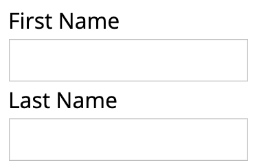

# Formatic

[](https://travis-ci.org/zapier/formatic)

Automatic forms. Find it on NPM - [https://www.npmjs.com/package/formatic](https://www.npmjs.com/package/formatic).

## Warning!

Formatic is currently in use in production, but the API is likely to change significantly in its next versions.

## What is formatic?

Formatic is a configurable, pluggable forms library for React. Pass in JSON fields that define your form, along with a value to be edited, and Formatic gives you form fields to edit your value.

## Using formatic

If you're happy with the default configuration, you can use it like this:

```js
// Get the formatic component.
import Formatic from 'formatic';

// Create some fields.
var fields = [
  {
    type: 'string',
    isSingleLine: true,
    key: 'firstName',
    label: 'First Name',
  },
  {
    type: 'str',
    isSingleLine: true,
    key: 'lastName',
    label: 'Last Name',
  },
];

// Render the form.
React.render(
  <Formatic fields={fields} onChange={newValue => console.log(newValue)} />,
  document.getElementById('my-form')
);
```

This creates a simple form like this:



## Documentation

To learn more, check out the [documentation](http://zapier.github.io/formatic/).

## Start hacking

```
git clone git@github.com:zapier/formatic.git
cd formatic
yarn install
yarn start
```

Your browser should automatically open to [http://localhost:3333/demo](http://localhost:3333/demo) (or other open port). Hack away on the code, and your changes should hot reload courtesy of Next.js.
